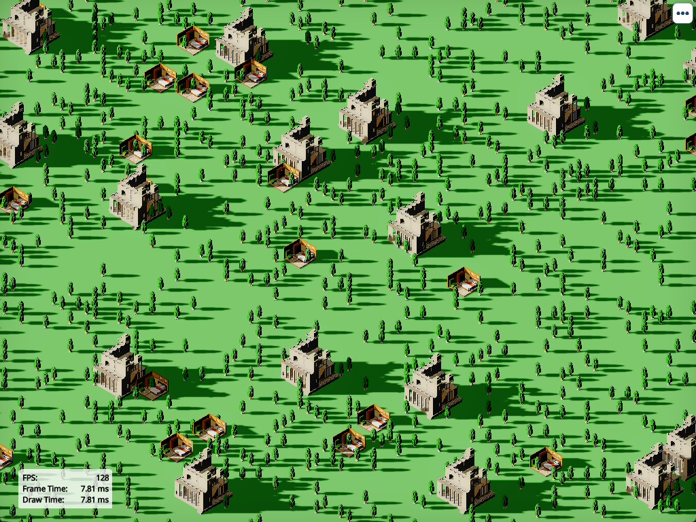
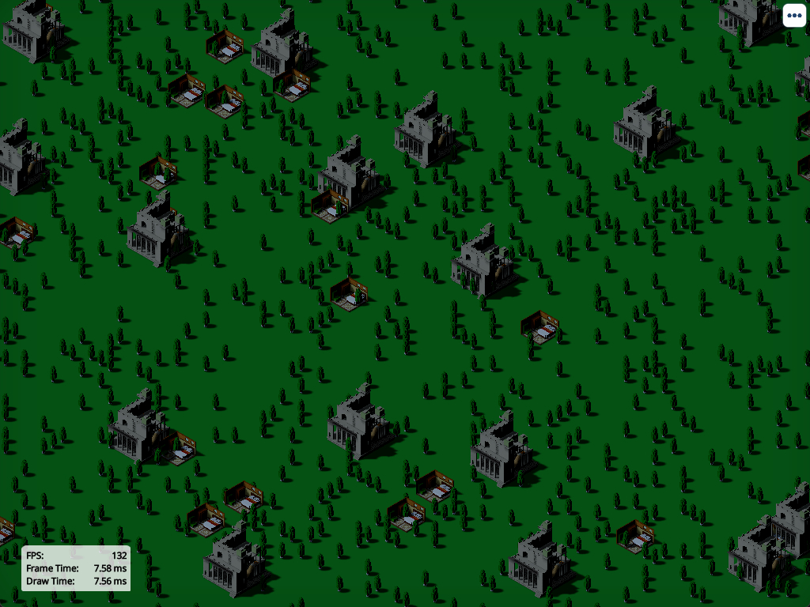
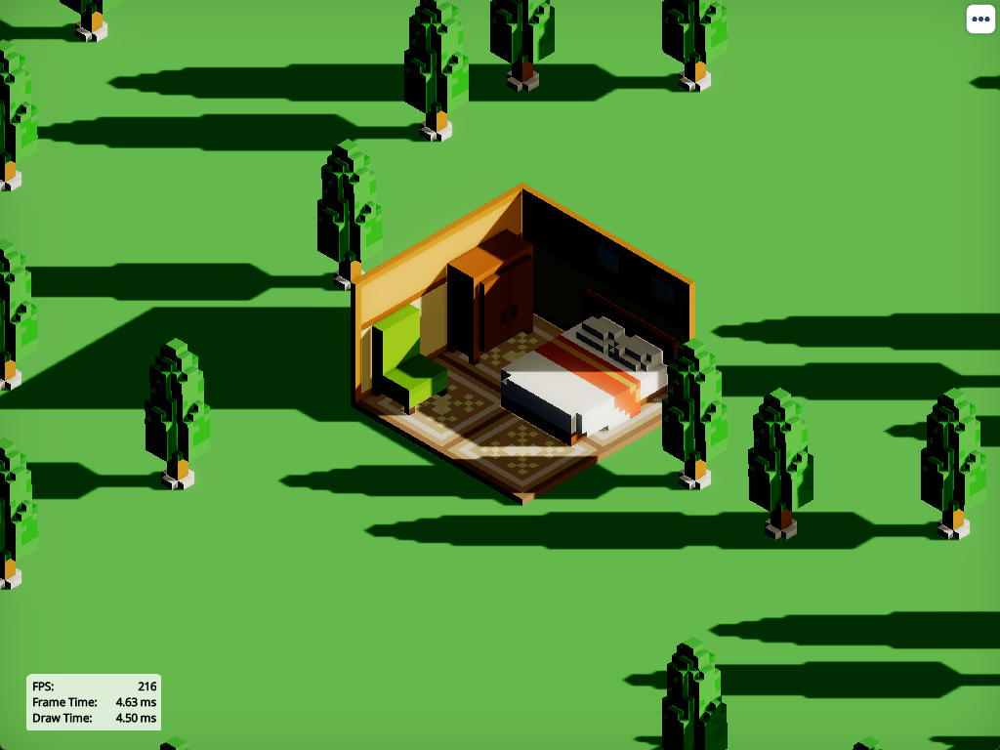
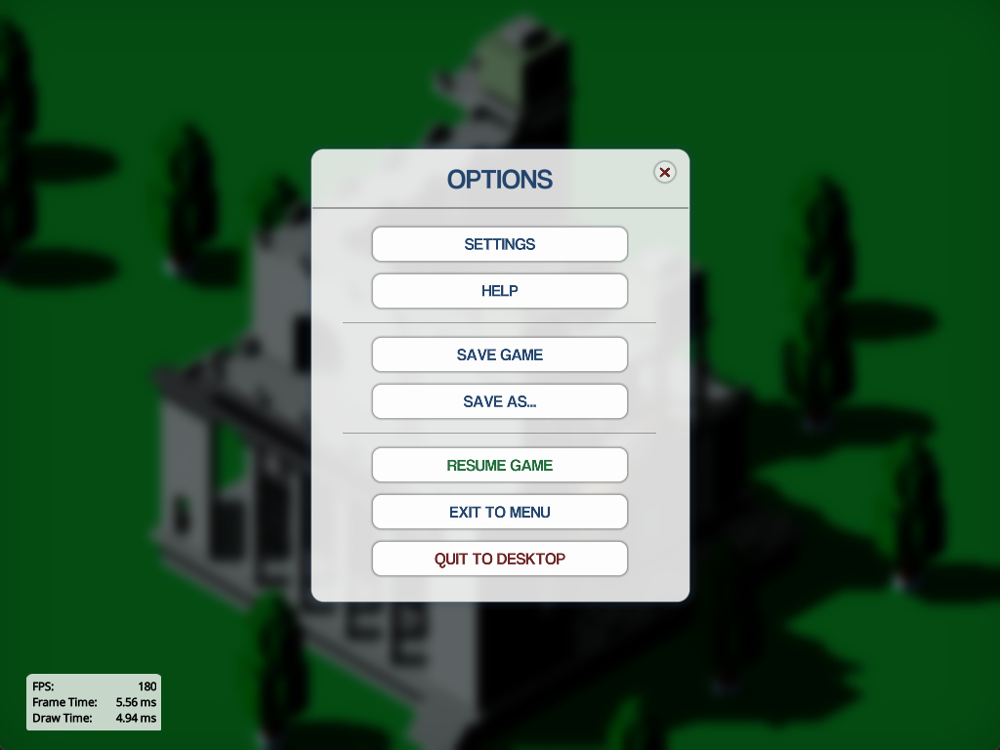

# 3D Voxel Game Engine.
Includes GUI, graphics rendering, effects, audio, and custom model file packaging. Written in Java with LWJGL and GLFW.
#

#
I wanted to create an engine that could handle an ode to the casual simulation games I enjoyed in years past. So far, I have gotten the following implemented (at their current level):

- GUI: A pretty standard scale-form GUI library that scales dynamically to a constant texel level. The text rendering leverages signed distance fields, and my current level of optimization has the static text/images batched away while dynamic text is batched itself when needed. So, I only have to update a few transformation buffers on the fly. The UI images are in a texture atlas, but I unpack them into an array texture at runtime.

- Voxel importing/rendering: I have an importer that can import voxel point-cloud files from MagicaVoxel, and package them into my own file format. The voxel format assumes precalculated ambient occlusion and greedy meshing, which I do in my packager. As the engine is to be isometric, I order the data by face when importing the files, such that I only render the three indexed camera-facing faces at runtime for the main pass, saving me some GPU rasterization time. For the shadow pass, I still have to render the other faces, but I may create a shadow-pass optimized mesh in the future, which greedy meshes without regard for occlusion values or vertex colors, to save some time on that pass. All the meshes are instance rendered.

- Shadows : For the shadows, I am using some standard shadow mapping. Due to the camera's perspective, separating into cascades is pointless, so I just fit a singular shadow map (4K in this example) tightly to the camera's frustum. I am going for a crisp, yet slightly soft style, which I am getting towards. Peter panning artifacts must be dealt with in full, due to the day/night cycle. I currently just cull front faces, and have used a few workarounds to deal with the light bleeding I am getting as a result. I still have some work to do with the light bleeding. For filtering, I found a sweet spot that uses Poisson-sampled radial shells with precomputed rotations. This method works best for me, since it minimizes early banding while not admitting the flickering artifacts you get with random sample offsets when the shadows update and move in real time.

- Lighting and Tonemapping: The lighting is just a simple Lambertian diffuse. It currently just has light sources from the sun and moon. Tuning the factors with the day/night cycle has been arduous, and it still could use much work. The lighting is all HDR, and gets tonemapped in post with the Hull ACES algorithm.

- Bloom: I kept it subtle here, since there aren't any light sources that should be contributing anyways. I used the progressive downsampling method introduced in COD Advanced Warfare, the one that the Unity Engine's new pipeline uses. Everything is done in compute shaders, and the entire pass with 6 mipmaps takes me 0.05ms for downsampling, upsampling, and mixing.

- Other: The engine uses a quad tree for culling, which is rather unnecessary for my world's size (~20x what is in view when zoomed out in each dimension). I use a global 8-bit color pallet for the voxel models, although it may be expanded if I want a different direction with the art as I add actual models.

The model in the center is modified from the default MagicaVoxel "monu2" model. It is a placeholder, like everything else.

The scene shown is at 800x800 with 4xMSAA and 4096x4096 shadows. I'm running an RTX 3080 12GB and i5-12400.
#

